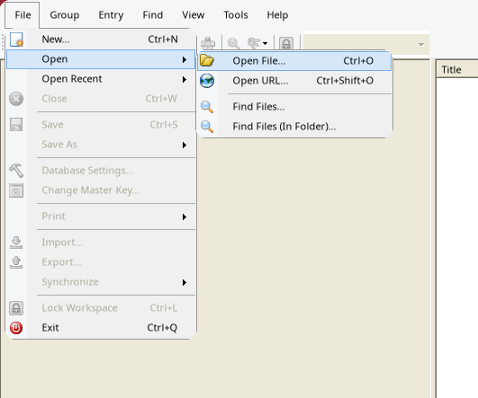
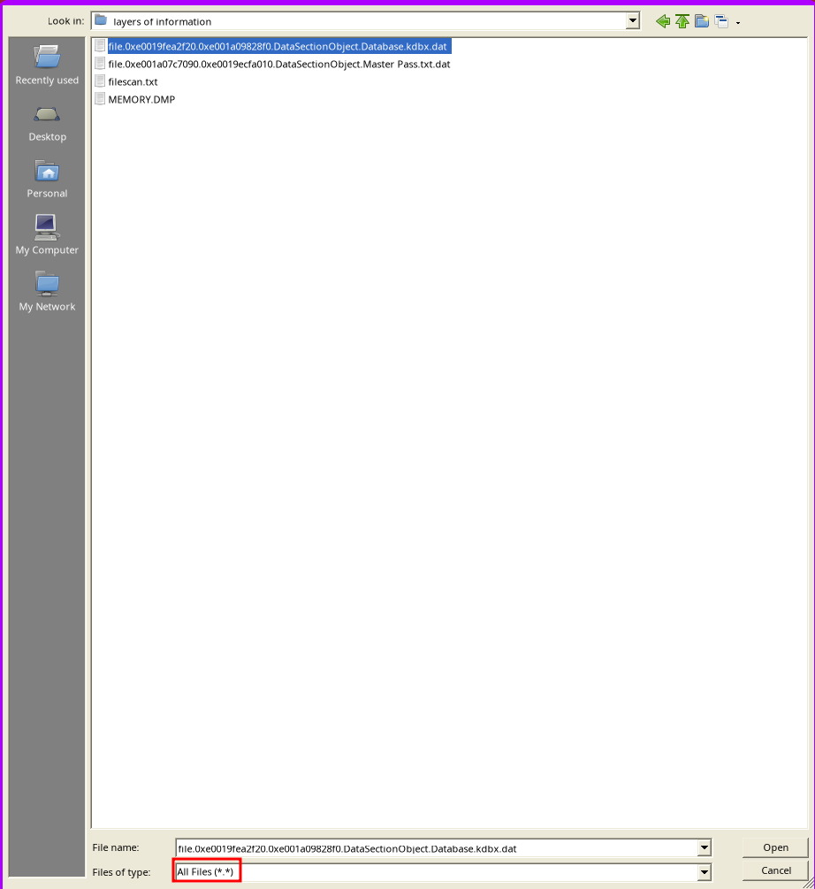
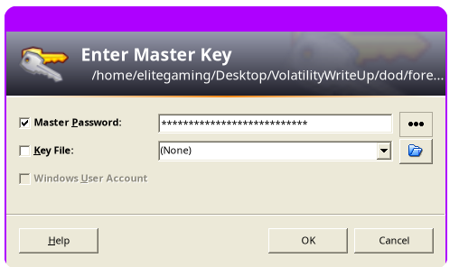
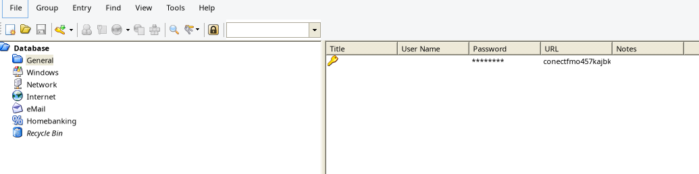
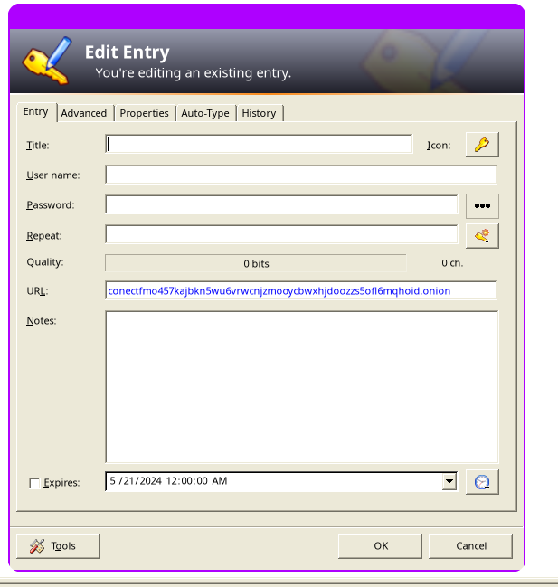
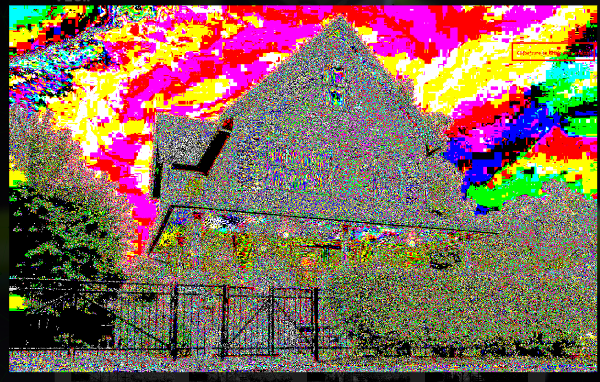

# DoD Cyber Sentinel Challenge - May 2024 Memory Forensics Writeups

## Layers of Information

### Enumerating Memory Dump Operating System

Enumerate whether the dump is a Windows or Unix based OS

```
kali@kali:~# file MEMORY.DMP
MEMORY.DMP: MS Windows 64bit crash dump, version 15.10240, 1 processors, full dump, 4992030524978970960 pages
```
> Key thing to catch is "MS Windows 64bit"

Now were going to enumerate what version of Windows it's using

```
kali@kali:~# volatility3 -f MEMORY.DMP windows.info
Progress:  100.00		PDB scanning finished                                
Variable	Value

Kernel Base	0xf800cbe1b000
DTB	0x1aa000
Symbols	file:///opt/volatility3/volatility3/symbols/windows/ntkrnlmp.pdb/3C77A20382CE4024A425C6A53F4B167F-1.json.xz
Is64Bit	True
IsPAE	False
layer_name	0 WindowsIntel32e
memory_layer	1 WindowsCrashDump64Layer
base_layer	2 FileLayer
KdDebuggerDataBlock	0xf800cc124b20
NTBuildLab	10240.17394.amd64fre.th1_st1.170
CSDVersion	0
KdVersionBlock	0xf800cc124e80
Major/Minor	15.10240
MachineType	34404
KeNumberProcessors	1
SystemTime	2024-04-07 23:42:01
NtSystemRoot	C:\Windows
NtProductType	NtProductWinNt
NtMajorVersion	10
NtMinorVersion	0
PE MajorOperatingSystemVersion	10
PE MinorOperatingSystemVersion	0
PE Machine	34404
PE TimeDateStamp	Fri Apr 28 01:35:56 2017
```
> Under the `PE MajorOperatingSystemVersion` variable we know it's using Windows 10

### File Enumeration
---
There are other very useful modules in the volatility framework, although the DoD Cyber Sentinel CTF only needed the `windows.filescan` and `windows.dumpfiles` modules.

Reference the following cheatsheet for command usage for other modules [VOLATILITY 2/3 CHEATSHEET](https://blog.onfvp.com/post/volatility-cheatsheet/)

We're going to start by running a filescan on the memory dump and outputting it to the `filescan.txt` file to allow us to grep through to find interesting files.

```
volatility3 -f MEMORY.DMP windows.filescan > filescan.txt
```
Filescans output a lot of default system files which don't concern us for the time being since we're looking for quick wins typically in user home directories `C:\Users\`


`grep "\Users"` is used to narrow down our search to User home directories

`grep -v AppData` is used to narrow down our search to files that aren't in AppData  
```
kali@kali:~# cat filescan.txt |grep "\Users"|grep -v AppData

0xe0019dc2bf20	\Users\Public\Desktop	216
0xe0019dc6e8d0	\Users\Administrator\NTUSER.DAT{77a2c7ec-26f0-11e5-80da-e41d2d741090}.TxR.2.regtrans-ms	216
0xe0019dc868d0	\Users\Administrator\Documents	216
0xe0019dc93490	\Device\HarddiskVolume2\Users\Administrator\NTUSER.DAT{77a2c7ec-26f0-11e5-80da-e41d2d741090}.TxR	216
0xe0019dc9a600	\Users\Administrator\NTUSER.DAT{77a2c7ec-26f0-11e5-80da-e41d2d741090}.TxR.blf	216
0xe0019dc9d5f0	\Users\Administrator\NTUSER.DAT{77a2c7ec-26f0-11e5-80da-e41d2d741090}.TxR.0.regtrans-ms	216
0xe0019dcebf20	\Users\Administrator\ntuser.dat.LOG1	216
0xe0019dd8f090	\Users\Administrator\Downloads\desktop.ini	216
0xe0019ddf7090	\Users\Administrator\Videos	216
0xe0019e5f9410	\Users\Public\Desktop\desktop.ini	216
0xe0019ee567a0	\Users\Administrator\Desktop	216
0xe0019ee62c10	\Users\Administrator\NTUSER.DAT{77a2c7ed-26f0-11e5-80da-e41d2d741090}.TM.blf	216
0xe0019ee6e9f0	\Users\Administrator\ntuser.dat.LOG2	216
0xe0019ee71f20	\Users\Administrator\Desktop	216
0xe0019eeb2460	\Users\Administrator\NTUSER.DAT{77a2c7ec-26f0-11e5-80da-e41d2d741090}.TxR.1.regtrans-ms	216
0xe0019eeb66d0	\Users\Administrator	216
0xe0019eec6090	\Users\Administrator\Contacts\desktop.ini	216
0xe0019eefc730	\Users\Administrator\OneDrive\desktop.ini	216
0xe0019ef12090	\Users\Administrator\Music	216
0xe0019ef39590	\Users\Administrator\Downloads	216
0xe0019ef8ded0	\Users\desktop.ini	216
0xe0019f098240	\Users\Administrator\Documents\desktop.ini	216
0xe0019f3fe7a0	\Users\Administrator\NTUSER.DAT{77a2c7ed-26f0-11e5-80da-e41d2d741090}.TMContainer00000000000000000001.regtrans-ms	216
0xe0019f465360	\Users\Administrator\Pictures	216
0xe0019f465cd0	\Users\Administrator\Pictures	216
0xe0019f466500	\Users\Administrator\Desktop	216
0xe0019f487ad0	\Users\Administrator\Videos	216
0xe0019f59f840	\Device\HarddiskVolume2\Users\Administrator\NTUSER.DAT{77a2c7ed-26f0-11e5-80da-e41d2d741090}.TM	216
0xe0019f5f0610	\Users\Administrator\Music\desktop.ini	216
0xe0019f5f86e0	\Users\Administrator\OneDrive	216
0xe0019fb57090	\Users\Administrator\Pictures\desktop.ini	216
0xe0019fb66090	\Users\Administrator	216
0xe0019fc06f20	\Users\Administrator\Videos\desktop.ini	216
0xe0019fe9b320	\Users\Administrator\Downloads	216
0xe0019fea2f20	\Users\Administrator\Desktop\Database.kdbx	216
0xe0019feb9090	\Users\Administrator\NTUSER.DAT{77a2c7ed-26f0-11e5-80da-e41d2d741090}.TMContainer00000000000000000002.regtrans-ms	216
0xe0019fee3b10	\Users\Administrator\Searches\desktop.ini	216
0xe0019fef0f20	\Users\Administrator\Saved Games\desktop.ini	216
0xe001a0150c40	\Users\Administrator\Music	216
0xe001a01a2f20	\Users\Administrator\Desktop\desktop.ini	216
0xe001a01c1090	\Users\Administrator\NTUSER.DAT	216
0xe001a02053d0	\Device\HarddiskVolume2\Users\Administrator\NTUSER.DAT{77a2c7ed-26f0-11e5-80da-e41d2d741090}.TM	216
0xe001a03751a0	\Users\Administrator\OneDrive	216
0xe001a06d4090	\Users\Public\Desktop	216
0xe001a07c7090	\Users\Administrator\Desktop\Master Pass.txt	216
0xe001a07fe610	\Users\Administrator\Favorites\desktop.ini	216
```
From the output of this we see that the only user that has a home directory is the Administrator user. We also find two interesting flies in the Administrators Desktop
```
Offset	        Name	                                        Size
0xe001a07c7090	\Users\Administrator\Desktop\Master Pass.txt	216
0xe0019fea2f20	\Users\Administrator\Desktop\Database.kdbx	216
```
> Keep note of the offset values which will be used to extract these files

For people that don't know ***.kbdx*** is the file extension used for KeePass databases. KeePass is a open-source locally hosted password manager that stores encrypted passwords in ***.kdbx*** files.

### File Dumping
---
Using the previously extracted file offsets we will use the `windows.dumpfiles` module to extract the files to our local machine for further analysis.

```
kali@kali:~# volatility3 -f MEMORY.DMP -o . windows.dumpfiles --virtaddr 0xe001a07c7090
Volatility 3 Framework 2.7.0

Cache	                FileObject	FileName	Result
DataSectionObject	0xe001a07c7090	Master Pass.txt	Error dumping file

kali@kali:~# volatility3 -f MEMORY.DMP -o . windows.dumpfiles --virtaddr 0xe0019fea2f20
Volatility 3 Framework 2.7.0

Cache	                FileObject	FileName	Result
DataSectionObject	0xe0019fea2f20	Database.kdbx	Error dumping file

kali@kali:~# ls -l
total 4194252
-rw------- 1 kali kali       4096 May 21 22:34  file.0xe0019fea2f20.0xe001a09828f0.DataSectionObject.Database.kdbx.dat
-rw------- 1 kali kali       4096 May 21 22:33 'file.0xe001a07c7090.0xe0019ecfa010.DataSectionObject.Master Pass.txt.dat'
-rw-r--r-- 1 kali kali     246665 May 21 22:10  filescan.txt
-rw-r--r-- 1 kali kali 4294650665 Apr  7 20:07  MEMORY.DMP
```
> You will be prompted with *Error dumping file*, althought the file was extracted and is fine  for analysis

### File Analysis
---
After extracting the files to our local machine we can now analyse both of the files.
```
kali@kali:~# cat file.0xe001a07c7090.0xe0019ecfa010.DataSectionObject.Master\ Pass.txt.dat 
Keypass DB Master Password: QWNoaW5lc3MzLlJlc2VhcmNoLkRpcmVjdGVk==
```
Based on characters in the string and ending with an "=" symbol we can attempt to decode this as a base64 string
```
kali@kali:~# echo "QWNoaW5lc3MzLlJlc2VhcmNoLkRpcmVjdGVk==" | base64 -d
Achiness3.Research.Directed
```
Now that we have the master password we can use it to decrypt the KeePass database. For this challenge I used the `keepass2` package from the ***kali-rolling*** repository.




Using the decoded password from `Master Pass.txt`



After successfully decrypting the KeePass Database file we see that there's a single entry




After checking out the entry we see that it has an onion link which after using a tor browser to access that page we are revealed the flag

Unfortunately the page is now down :(

## Photographic Memory

### OS Enumeration

Typically at this point we'll start by enumerating OS info, although given that the file we have is named `win11.vmem` its safe to assume we're going to be working with a Windows 11 memory dump

### File Enumeration

Using the same syntax from the previous challenge we're going to scan for files and parse through filter to only see user home directories in `C:\Users`

```
kali@kali:~# volatility3 -f win11.vmem windows.filescan > filescan.txt
```

```
kali@kali:~# c0xb101de073570	\Users\User\NTUSER.DAT	216


0xb101de074830	\Users\User\ntuser.dat.LOG1	216
0xb101de0749c0	\Users\User\ntuser.dat.LOG2	216
0xb101de075640	\Users\User\NTUSER.DAT{3a2bdf2a-b03a-11ee-883b-000c29f21a02}.TMContainer00000000000000000002.regtrans-ms	216
0xb101de075e10	\Device\HarddiskVolume4\Users\User\NTUSER.DAT{3a2bdf2a-b03a-11ee-883b-000c29f21a02}.TM	216
0xb101de076db0	\Device\HarddiskVolume4\Users\User\NTUSER.DAT{3a2bdf2a-b03a-11ee-883b-000c29f21a02}.TM	216
0xb101de077710	\Users\User\NTUSER.DAT{3a2bdf2a-b03a-11ee-883b-000c29f21a02}.TM.blf	216
0xb101de776550	\Users\Public\Desktop	216
0xb101de7766e0	\Users\Public\Desktop	216
0xb101de7787b0	\Users\User\Desktop	216
0xb101de778940	\Users\User\Desktop	216
0xb101de94c0b0	\Users\User\Downloads	216
0xb101df9863f0	\Users\User\Documents	216
0xb101dfa3cc20	\Users\User\Desktop\houses.docx	216
0xb101dfa41bd0	\Users\desktop.ini	216
0xb101dfa426c0	\Users\User\Desktop\desktop.ini	216at filescan.txt |grep "\Users"|grep -v AppData

```
We find a interesting file named houses.docx
```

Offset	        Name	                            Size
0xb101dfa3cc20	\Users\User\Desktop\houses.docx	    216
```

### File Dumping

Similar to the previous challenge we will then dump the file using the offset with the `windows.dumpfiles` modules.

```
kali@kali:~# volatility3 -f win11.vmem -o . windows.dumpfiles --virtaddr 0xb101dfa3cc20

Cache	                FileObject	FileName	Result

DataSectionObject	0xb101dfa3cc20	houses.docx	Error dumping file
```
> Again we will be returned with an error, although the extracted file is fine for analysis

If we open the file in Microsoft word there's nothing interesting found besides photos of houses. From the challenges prompt we know that the hidden information is stored in a photo in a document.

### File Analysis

**.docx** files are glorified zip files that can be interpreter by word processors. Being so we can use the following command to obtain the raw images in the file.
```
kali@kali:~# unzip file.0xb101dfa3cc20.0xb101de175af0.DataSectionObject.houses.docx-1.dat

Archive:  file.0xb101dfa3cc20.0xb101de175af0.DataSectionObject.houses.docx-1.dat
  inflating: [Content_Types].xml     
  inflating: _rels/.rels             
  inflating: word/_rels/document.xml.rels  
  inflating: word/document.xml       
 extracting: word/media/image18.jpeg  
 extracting: word/media/image15.jpeg  
 extracting: word/media/image17.jpeg  
 extracting: word/media/image1.jpeg  
 extracting: word/media/image2.jpeg  
 extracting: word/media/image3.jpeg  
 extracting: word/media/image4.jpeg  
 extracting: word/media/image5.jpeg  
 extracting: word/media/image6.jpeg  
 extracting: word/media/image7.jpeg  
 extracting: word/media/image8.jpeg  
 extracting: word/media/image9.jpeg  
 extracting: word/media/image10.jpeg  
 extracting: word/media/image11.jpeg  
 extracting: word/media/image12.jpeg  
 extracting: word/media/image13.jpeg  
 extracting: word/media/image14.jpeg  
 extracting: word/media/image16.jpeg  
 extracting: word/media/image19.jpeg  
 extracting: word/media/image20.jpeg  
 extracting: word/media/image21.jpeg  
 extracting: word/media/image22.jpeg  
 extracting: word/media/image23.jpeg  
 extracting: word/media/image24.jpeg  
 extracting: word/media/image25.jpeg  
 extracting: word/media/image26.jpeg  
 extracting: word/media/image27.jpeg  
 extracting: word/media/image28.jpeg  
 extracting: word/media/image29.jpeg  
  inflating: word/theme/theme1.xml   
  inflating: word/settings.xml       
  inflating: word/webSettings.xml    
  inflating: docProps/app.xml        
  inflating: word/fontTable.xml      
  inflating: docProps/core.xml       
  inflating: word/styles.xml
```
> Imagees are stored under `word/media/`

Using the following script we can attempt to extract hidden files within all of the images.

```
#!/bin/bash
for i in {1..29}
do
   echo image$i.jpeg
   steghide extract -sf image$i.jpeg -p ''
done

```

```
kali@kali:~# ./stegextract.sh

image1.jpeg
steghide: could not extract any data with that passphrase!
image2.jpeg
steghide: could not extract any data with that passphrase!
image3.jpeg
steghide: could not extract any data with that passphrase!
image4.jpeg
steghide: could not extract any data with that passphrase!
image5.jpeg
steghide: could not extract any data with that passphrase!
image6.jpeg
steghide: could not extract any data with that passphrase!
image7.jpeg
steghide: could not extract any data with that passphrase!
image8.jpeg
wrote extracted data to "readmenow.txt".
image9.jpeg
steghide: could not extract any data with that passphrase!
image10.jpeg
steghide: could not extract any data with that passphrase!
image11.jpeg
steghide: could not extract any data with that passphrase!
image12.jpeg
steghide: could not extract any data with that passphrase!
image13.jpeg
steghide: could not extract any data with that passphrase!
image14.jpeg
steghide: could not extract any data with that passphrase!
image15.jpeg
steghide: could not extract any data with that passphrase!
image16.jpeg
steghide: could not extract any data with that passphrase!
image17.jpeg
steghide: could not extract any data with that passphrase!
image18.jpeg
steghide: could not extract any data with that passphrase!
image19.jpeg
steghide: could not extract any data with that passphrase!
image20.jpeg
steghide: could not extract any data with that passphrase!
image21.jpeg
steghide: could not extract any data with that passphrase!
image22.jpeg
steghide: could not extract any data with that passphrase!
image23.jpeg
steghide: could not extract any data with that passphrase!
image24.jpeg
steghide: could not extract any data with that passphrase!
image25.jpeg
steghide: could not extract any data with that passphrase!
image26.jpeg
steghide: could not extract any data with that passphrase!
image27.jpeg
steghide: could not extract any data with that passphrase!
image28.jpeg
steghide: could not extract any data with that passphrase!
image29.jpeg

```

Through this script we were able to extract a file from image8.jpeg named ***image8.jpeg***. Next we will analyze the content's of that file

```
kali@kali:~# cat readmenow.txt
XX{correct_file_but_not_the_correct_flag}
```

So now we know the flag is somewhere in ***image8.jpeg***

Next we will use [aperisolve](https://www.aperisolve.com/) which is a online tool to aid in image analysis using various techniques.


After looking at the image closely you will be able to see the flag, although not clearly, towrads the top right which I surrounded in the red box to make it easier to identify. After playing around with different hues, saturations, and brightnesses you will be able to make the flag readible.


